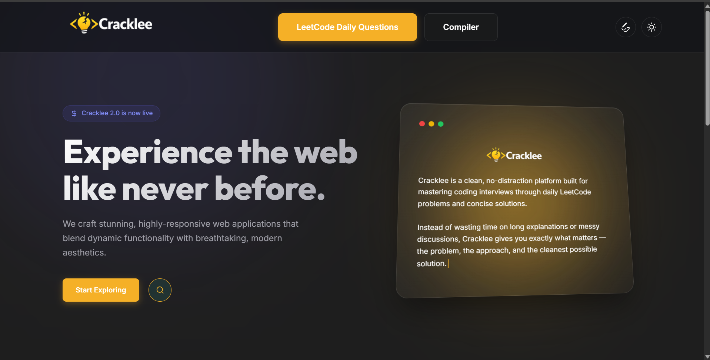

# Cracklee – LeetCode Daily Solutions Answers Platform

Cracklee is a web-based platform designed to organize and display daily LeetCode problem solutions in a structured and accessible format. It helps users quickly view problems and their corresponding answers in one place.

---

## 🚀 Features

- 📌 Organized collection of daily LeetCode problems
- 📖 Structured display of problem statements and solutions
- 🎯 Easy navigation for quick access
- 💻 Clean and responsive user interface

---

## 🛠️ Tech Stack

- HTML
- CSS
- JavaScript

---

## 📸 Preview




---

## 📂 Project Structure

cracklee/
│── index.html
│── style.css
│── script.js
│── screenshot.png
```

👤 Author
Chandra Mouli 
